# 松典 B2B 官网重构 · 后端实现计划（ARCHITECTURE_PLAN）

> ✅ **计划已执行完毕（2026-07）**：本文档为设计阶段产物，所有冻结版本（FastAPI 0.139、Tortoise 1.1.7、Python 3.14）均已可用并落地实施。
> §0 的「版本偏差」已不再适用——当前代码即按冻结版本运行。
> 实际技术栈与目录结构见根 `README.md` 和 `backend/README.md`。
> ⚠️ **M6 数据迁移模块（WordPress ETL）已移除（2026-07-27）**：原 `backend/migration/`（wp_adapter/etl/image_sync/backfill 等）、`/api/v1/admin/migration/*` 端点、RBAC 权限 `migration:read`/`migration:run` 已全部删除。WP→PG 主迁移已完成，该模块为一次性工具，日常业务不依赖。**注意区分**：本文档其余处的「迁移」多指 **aerich 数据库 schema 迁移（DDL）**——该项保留，与 M6 无关。

> **作者**：软件架构师（高见远，software-architect）
> **定位**：把已冻结的设计文档（系统设计 / 高层架构 / 安全设计 / 部署设计）**收敛为「工程师可直接照写的文件级有序实现计划 + 合并后的数据模型定义」**。
> **本轮范围**：仅后端 `songdian-b2b/backend/`。前端（Next.js）与管理后台（Vue-Pure-Admin）本轮不做。
> **设计基线已冻结**：技术栈 FastAPI + Tortoise ORM + PostgreSQL 16（zhparser TSVector）+ Redis 7.2 + Docker Compose；JWT(2h/refresh 7d) + RBAC。本文件**不重新设计**，只做落地编排。

---

## 0. 版本偏差声明（先读这一节）

设计文档 §3.1.5 冻结了以下版本，但其中部分当前（写稿时）**在 PyPI 上尚不存在或不可安装**。工程师**务必以本计划 §4 的务实版本为准**安装；代码注释与 README 中声明「目标冻结版本」备查。

| 设计冻结版本 | 当前可执行版本（务实推荐） | 偏差原因 | 处理 |
| --- | --- | --- | --- |
| Python 3.14 | **Python 3.12**（建议）/ 3.11 | 3.14 未发布 | `requires-python = ">=3.11,<3.14"`；README 注明目标 3.14 |
| FastAPI 0.139.2 | **FastAPI 0.115.x**（pydantic v2） | 0.139.2 不存在 | 0.115 是稳定主线；API 写法无差异 |
| Tortoise ORM 1.1.7 | **Tortoise-ORM 0.21.x 或 0.23.x** | 1.1.7 不存在 | 0.21+ 兼容 pydantic v2 + aerich |
| 未指定迁移工具 | **aerich 0.7.x**（Tortoise 官方） | 设计只写「aerich」 | 用 aerich 生成并管理 DDL 迁移 |
| 中文分词 | **zhparser 2.2（PG 扩展）** | 是 PG 扩展，非 Python 包 | 在 PG 镜像内 `CREATE EXTENSION zhparser` + 建 `zh` 文本检索配置 |

> 其余设计要素（13 张表、错误码、幂等、限流、缓存 Key、RBAC、审计、降级 BD-01~04）**100% 沿用冻结设计，不偏离**。

---

## 1. 精确文件树（backend/ 全部待建源文件 + 一句话职责）

```
songdian-b2b/backend/
├── pyproject.toml                # 依赖、requires-python、ruff/pytest 配置、[tool.aerich] 配置
├── aerich.ini                    # aerich 迁移工具入口配置（连接 PG / SQLite）
├── Dockerfile                    # backend 多阶段镜像（非 root、uvicorn 启动）
├── Dockerfile.pg                 # PostgreSQL 16 镜像 + zhparser 扩展 + 初始化 zh 配置（生产/本地）
├── docker-compose.yml            # 本地编排：backend + postgres(zhparser) + redis
├── .env.example                  # 全部环境变量样例（DB/Redis/JWT/SMTP/限流/特征值）
├── .dockerignore
├── README.md                     # 启动/测试/迁移/部署说明 + §0 版本偏差声明
├── main.py                       # 应用入口：创建 FastAPI(app)、聚合各模块 router、注册中间件/异常/ lifespan
├── common/                       # ── 公共内核（Shared Kernel，M1~M6 共用）──
│   ├── __init__.py
│   ├── config.py                 # Settings(pydantic-settings)：读 .env；DB_URL/REDIS_URL/JWT 密钥/SMTP/限流阈值
│   ├── result.py                 # Result（code/msg/msgI18n/data/traceId/timestamp）、PageRequest、PageResponse
│   ├── enums.py                  # BaseEnum 基类 + 全部业务状态枚举（ProductStatus/NewsStatus/InquiryStatus/SmtpStatus/...）
│   ├── exceptions.py             # BizException + ErrorCode(A/B/C 全量错误码) + register_exception_handlers(app)
│   ├── logger.py                 # 结构化日志：注入 traceId + tenantId(常量 songdian)，禁止打印密钥
│   ├── deps.py                   # 依赖注入：get_current_user / require_permission(code) / get_redis / get_settings
│   ├── jwt.py                    # JWT 工具：签发/校验 access(2h)/refresh(7d)，HS256，含 jti；黑名单查 auth:black:{jti}
│   ├── password.py               # bcrypt 哈希/校验封装（CRED-04）
│   ├── html_cleaner.py           # 新闻/产品 content_html 白名单清洗（bleach），防存储型 XSS
│   ├── idempotency.py            # 幂等依赖/中间件：X-Idempotency-Key、biz_req_no，Redis SETNX 24h
│   ├── ratelimit.py              # 限流依赖/中间件：单 IP/单用户/QPS，Redis 滑动窗口；阈值读 config
│   ├── search_vector.py          # Shared Kernel：TSVectorField 自定义字段 + update_search_vector() 工具 + SQLite 降级开关
│   ├── audit.py                  # @audit(action, resource) 装饰器：异步写 t_audit_log（who/when/what/result/ip）
│   └── middleware.py             # 请求中间件：traceparent/traceId 注入、X-Forwarded-For 真实 IP、CORS、tenantId 常量
├── product/                       # ── M1 产品服务 ──
│   ├── __init__.py
│   ├── models.py                 # Product / ProductCategory / ProductGallery / ProductAttribute（Tortoise）
│   ├── schemas.py                # ProductCreateRequest/ProductUpdateRequest/ProductDetailVO/ProductPageVO/CategoryTreeVO
│   ├── routers.py                # /api/v1/products、/product-categories、/admin/products、/admin/products/{id}/gallery|attributes
│   └── services.py              # CRUD、search_vector 维护、product:detail:{slug} 缓存读写、软删级联
├── news/                         # ── M2 新闻服务 ──
│   ├── __init__.py
│   ├── models.py                 # News / NewsCategory
│   ├── schemas.py                # NewsCreateRequest/NewsUpdateRequest/NewsDetailVO/NewsPageVO
│   ├── routers.py                # /api/v1/news、/news-categories、/admin/news、/admin/news/{id}
│   └── services.py              # CRUD、html-cleaner 清洗、search_vector 维护、news:detail:{slug} 缓存
├── search/                       # ── M3 联合搜索服务 ──
│   ├── __init__.py
│   ├── models.py                 # （读模型，无独立表；可放 SearchItem 值对象占位）
│   ├── schemas.py                # SearchRequest / SearchItemVO / SearchPageVO
│   ├── routers.py                # /api/v1/search
│   └── services.py              # 联合 TSVector 查询 + BD-01 降级 LIKE + search:q:{hash}:{type}:{page} 缓存（60s）
├── inquiry/                      # ── M4 询盘服务 ──
│   ├── __init__.py
│   ├── models.py                 # Inquiry
│   ├── schemas.py                # InquirySubmitRequest / InquiryStatusRequest / InquiryVO / InquiryDetailVO
│   ├── routers.py                # /api/v1/inquiries、/admin/inquiries、/admin/inquiries/{id}、/admin/inquiries/{id}/status
│   ├── services.py               # 提交+幂等(biz_req_no)+持久化+触发 SMTP+状态机
│   └── smtp_mailer.py           # SMTP 发信封装（smtp.qq.com:587 STARTTLS）；未配置仅持久化（MOCK/BD-02）
├── content/                      # ── M5 内容管理服务（登录+RBAC+审计）──
│   ├── __init__.py
│   ├── models.py                 # AdminUser / Role / RolePermission / AuditLog
│   ├── schemas.py                # LoginRequest/LoginVO/LogoutVO/RoleCreateRequest/RolePermRequest/RoleVO/AuditPageVO
│   ├── routers.py                # /api/v1/admin/login、/logout、/roles、/roles/{id}/permissions、/audit-logs
│   ├── services.py               # 登录校验(bcrypt+锁定)、签发 JWT、角色权限缓存(auth:perm:{uid})、审计写库
│   └── permissions.py            # 权限码常量目录（PRODUCT_CREATE="product:create" 等）+ 初始角色→权限映射
├── migration/                     # ── M6 数据迁移模块（ETL + ACL）──（已移除 2026-07-27）
│   ├── __init__.py
│   ├── models.py                 # MigrationBatch / MigrationRecord
│   ├── schemas.py                # MigrationRunRequest / MigrationBatchVO / MigrationBatchDetailVO
│   ├── routers.py                # /api/v1/admin/migration/run、/batches、/batches/{id}
│   ├── services.py               # 批次编排、行数/内容/业务对账（§4.5.4）
│   ├── wp_adapter.py            # ACL 防腐层 WordPressProductAdapter：wp_postmeta→规格/相册/价格
│   └── etl.py                    # WP REST 拉取 + 清洗 + 批量写入 + search_vector 重建（BD-04 源不可达暂停）
├── seed/                          # ── 种子数据（首次部署）──
│   ├── __init__.py
│   └── seed_data.py             # 6 产品分类 + 2 新闻分类 + 1 初始 admin（bcrypt 密码）
├── tests/                         # ── 本地测试（SQLite 跑通非搜索接口）──
│   ├── conftest.py              # 用 aiosqlite 起 Tortoise（ squashed 模型），注入 test client
│   ├── test_product.py          # 产品 CRUD + slug 唯一 + 详情缓存
│   ├── test_news.py
│   ├── test_inquiry.py          # 幂等 biz_req_no + 校验
│   ├── test_auth.py             # 登录 + JWT + 权限依赖
│   └── test_search_sqlite.py    # SQLite 下降级 LIKE 路径
└── docs/
    └── ARCHITECTURE_PLAN.md      # 本文件
```

> **布局说明**：严格沿用 §3.1.4 扁平布局（`backend/common`、`backend/product` … `backend/main.py`），每个包含 `__init__.py`，运行时以 `backend/` 为 cwd，`uvicorn main:app` 即可直接 `import common / product / ...`。所有模型注册到**同一个 Tortoise app 标签 `models`**，跨模块外键用 `'models.Role'` 形式引用。

---

## 2. 有序任务清单（按依赖排列）

> 依赖关系自上而下；**T01 必须先完成**（基础设施与配置），其后各模块可并行度由依赖决定。优先级：P0=阻塞主链路，P1=重要，P2=增强。

| 任务 | 名称 | 产出文件（节选） | 依赖 | 优先级 |
| --- | --- | --- | --- | --- |
| **T01** | 项目基础设施与配置 | `pyproject.toml`、`aerich.ini`、`Dockerfile`、`Dockerfile.pg`、`docker-compose.yml`、`.env.example`、`.dockerignore`、`README.md`、`main.py`（骨架+health）、`common/config.py`、`common/logger.py`、`common/__init__.py` | — | P0 |
| **T02** | 公共内核（Shared Kernel） | `common/result.py`、`enums.py`、`exceptions.py`、`middleware.py`、`deps.py`、`jwt.py`、`password.py`、`html_cleaner.py`、`idempotency.py`、`ratelimit.py`、`search_vector.py`、`audit.py` | T01 | P0 |
| **T03** | 全部数据模型（Tortoise）+ 初始迁移 | `product/models.py`、`news/models.py`、`inquiry/models.py`、`content/models.py`、`migration/models.py`、aerich 初始迁移（`upgrade()` 内含 GIN 索引 + CHECK 约束 + zh 配置） | T02 | P0 |
| **T04** | M1 产品服务 | `product/{schemas,routers,services}.py` | T03 | P0 |
| **T05** | M2 新闻服务 | `news/{schemas,routers,services}.py` | T03 | P0 |
| **T06** | M5 内容管理（登录+RBAC+审计） | `content/{schemas,routers,services,permissions}.py` | T03 | P0 |
| **T07** | M4 询盘服务 | `inquiry/{schemas,routers,services,smtp_mailer}.py` | T03, T06(权限) | P0 |
| **T08** | M3 联合搜索服务 | `search/{schemas,routers,services}.py` | T03, T04, T05 | P0 |
| **T09** | main.py 路由聚合 + 中间件/异常注册 | `main.py`（完整）、各模块 router 挂载、全局异常处理器、`/healthz`、`/readyz` | T04~T08 | P0 |
| **T10** | M6 数据迁移模块（ETL+ACL） | `migration/{schemas,routers,services,wp_adapter,etl}.py` | T03, T04, T05 | P1 |（模块已移除 2026-07-27）
| **T11** | 种子数据 + Docker/CI 收尾 | `seed/seed_data.py`、`tests/*`、README 补充 | T09, T10 | P1 |
| **T12** | 本地联调与测试（SQLite 跑通非搜索；PG 跑搜索） | `tests/conftest.py` + 各 test_*.py；`docker-compose up` 冒烟 | T11 | P1 |

**关键依赖链**：T01 → T02 → T03 → {T04,T05,T06} → {T07(需T06),T08(需T04+T05)} → T09 → T10 → T11 → T12。
**并行建议**：T04/T05/T06 在 T03 后并行；T07 等 T06；T08 等 T04+T05。

---

## 3. 合并后的数据模型定义（Tortoise ORM）

> 覆盖冻结设计 §4 全部 **13 张表**。说明：
> - 设计文档中「t_permission」在冻结 DDL 实际以 **`t_role_permission`（role_id, permission_code）关联表**呈现（无独立权限实体），故本计划以 `RolePermission` 建模，权限以**代码字符串常量**管理（见 `content/permissions.py`）。
> - `search_vector` 用自定义 `TSVectorField`（§1 `common/search_vector.py`），GIN 索引与 CHECK 约束在 aerich 初始迁移的 `upgrade()` 中以**原生 SQL**落地（Tortoise 不直接声明 CHECK/GIN）。
> - 时间戳/软删/审计字段用 Mixin 复用，仅对 DDL 中确实存在的列使用。

### 3.1 common/search_vector.py（TSVector 字段 + 维护工具）

```python
from tortoise.fields import Field

class TSVectorField(Field):
    """映射 PostgreSQL TSVECTOR 列；Tortoise 不直接读写，仅用于建表与持有值。"""
    SQL_TYPE = "TSVECTOR"

    def __init__(self, **kwargs):
        kwargs.setdefault("null", True)
        super().__init__(**kwargs)

    def to_db_bool(self, value, instance):  # 写时交给原生 SQL，不传参
        return value

# ── 维护工具（Shared Kernel，product/news 共用）──
import json
from tortoise import connections

# SQLite 下降级：search_vector 列不存在，搜索走 LIKE
def is_sqlite() -> bool:
    from common.config import settings
    return settings.database_url.startswith("sqlite")

async def update_search_vector(table: str, pk: int, *text_fields: str) -> None:
    """写后/迁移后重建某行 search_vector = to_tsvector('zh', 拼接字段)。PG 专用。"""
    if is_sqlite():
        return  # SQLite 无该列，搜索降级 LIKE
    joined = " || ' ' || ".join(f"COALESCE({f},'')" for f in text_fields)
    sql = f"UPDATE {table} SET search_vector = to_tsvector('zh', {joined}) WHERE id = %s"
    await connections.get("default").execute_query(sql, [pk])
```

### 3.2 Mixin 与枚举基类

```python
from tortoise import fields, models
from common.enums import BaseEnum

class TimestampedMixin(models.Model):
    created_time = fields.DatetimeField(auto_now_add=True, null=True)
    updated_time = fields.DatetimeField(auto_now=True, null=True)
    class Meta:
        abstract = True

class SoftDeleteMixin(models.Model):
    deleted = fields.SmallIntField(default=0, description="0 存在 / 1 删除")  # SMALLINT
    class Meta:
        abstract = True

class AuditByMixin(models.Model):
    created_by = fields.CharField(max_length=64, null=True)
    updated_by = fields.CharField(max_length=64, null=True)
    class Meta:
        abstract = True
```

### 3.3 product/models.py

```python
from tortoise import fields, models
from common.search_vector import TSVectorField
from common.mixins import TimestampedMixin, SoftDeleteMixin, AuditByMixin  # 见 3.2

class ProductCategory(TimestampedMixin, SoftDeleteMixin, models.Model):
    id = fields.BigIntField(primary_key=True)
    name = fields.CharField(max_length=100)
    slug = fields.CharField(max_length=100, unique=True)
    sort_order = fields.IntField(default=0)
    class Meta:
        table = "t_product_category"

class Product(TimestampedMixin, SoftDeleteMixin, AuditByMixin, models.Model):
    id = fields.BigIntField(primary_key=True)
    slug = fields.CharField(max_length=200, unique=True)
    title = fields.CharField(max_length=200)
    summary = fields.CharField(max_length=500)
    content_html = fields.TextField()
    category = fields.ForeignKeyField("models.ProductCategory", related_name="products",
                                      on_delete=fields.RESTRICT)
    sku = fields.CharField(max_length=100, null=True)
    price = fields.DecimalField(max_digits=12, decimal_places=2, null=True)
    currency = fields.CharField(max_length=10, default="CNY")
    stock_status = fields.CharField(max_length=20, default="instock")  # instock/outofstock
    status = fields.CharField(max_length=30, default="DRAFT")           # DRAFT/PUBLISHED
    search_vector = TSVectorField()
    galleries = fields.ReverseRelation("ProductGallery")
    attributes = fields.ReverseRelation("ProductAttribute")
    class Meta:
        table = "t_product"
        # idx_category_status / idx_created_time 由索引或迁移 SQL 建立

class ProductGallery(models.Model):
    id = fields.BigIntField(primary_key=True)
    product = fields.ForeignKeyField("models.Product", related_name="galleries",
                                     on_delete=fields.CASCADE)
    image_url = fields.CharField(max_length=500)
    alt = fields.CharField(max_length=200, null=True)
    sort_order = fields.IntField(default=0)
    class Meta:
        table = "t_product_gallery"

class ProductAttribute(models.Model):
    id = fields.BigIntField(primary_key=True)
    product = fields.ForeignKeyField("models.Product", related_name="attributes",
                                     on_delete=fields.CASCADE)
    name = fields.CharField(max_length=100)
    slug = fields.CharField(max_length=100)
    value = fields.CharField(max_length=500)
    class Meta:
        table = "t_product_attribute"
```

### 3.4 news/models.py

```python
class NewsCategory(TimestampedMixin, SoftDeleteMixin, models.Model):
    id = fields.BigIntField(primary_key=True)
    name = fields.CharField(max_length=100)
    slug = fields.CharField(max_length=100, unique=True)
    sort_order = fields.IntField(default=0)
    class Meta:
        table = "t_news_category"

class News(TimestampedMixin, SoftDeleteMixin, AuditByMixin, models.Model):
    id = fields.BigIntField(primary_key=True)
    slug = fields.CharField(max_length=200, unique=True)
    title = fields.CharField(max_length=200)
    summary = fields.CharField(max_length=500)
    content_html = fields.TextField()
    category = fields.ForeignKeyField("models.NewsCategory", related_name="news",
                                      on_delete=fields.RESTRICT)
    author = fields.CharField(max_length=100, null=True)
    published_at = fields.DatetimeField(auto_now_add=True)
    status = fields.CharField(max_length=30, default="PUBLISHED")  # DRAFT/PUBLISHED
    search_vector = TSVectorField()
    class Meta:
        table = "t_news"
```

### 3.5 inquiry/models.py

```python
class Inquiry(models.Model):
    id = fields.BigIntField(primary_key=True)
    name = fields.CharField(max_length=50)
    email = fields.CharField(max_length=200)
    phone = fields.CharField(max_length=20, null=True)
    company = fields.CharField(max_length=100, null=True)
    country = fields.CharField(max_length=100, null=True)
    product_interest = fields.CharField(max_length=200, null=True)
    message = fields.CharField(max_length=2000)
    source_page = fields.CharField(max_length=500, null=True)
    biz_req_no = fields.CharField(max_length=100, unique=True)        # 幂等键兜底
    status = fields.CharField(max_length=30, default="NEW")           # NEW/REPLIED/ARCHIVED
    smtp_status = fields.CharField(max_length=30, default="PENDING")  # PENDING/SENT/FAILED/ERROR
    smtp_retry = fields.IntField(default=0)
    reply_note = fields.CharField(max_length=1000, null=True)
    created_time = fields.DatetimeField(auto_now_add=True, null=True)
    updated_time = fields.DatetimeField(auto_now=True, null=True)
    class Meta:
        table = "t_inquiry"
```

### 3.6 content/models.py（RBAC + 审计）

```python
class AdminUser(TimestampedMixin, models.Model):
    id = fields.BigIntField(primary_key=True)
    username = fields.CharField(max_length=64, unique=True)
    password_hash = fields.CharField(max_length=100)
    email = fields.CharField(max_length=200, null=True)
    role = fields.ForeignKeyField("models.Role", related_name="users",
                                  on_delete=fields.RESTRICT)
    status = fields.CharField(max_length=30, default="ENABLED")  # ENABLED/DISABLED/LOCKED
    last_login = fields.DatetimeField(null=True)
    login_fail = fields.IntField(default=0)
    class Meta:
        table = "t_admin_user"

class Role(models.Model):
    id = fields.BigIntField(primary_key=True)
    name = fields.CharField(max_length=100)
    code = fields.CharField(max_length=100, unique=True)   # operator / admin
    remark = fields.CharField(max_length=200, null=True)
    class Meta:
        table = "t_role"

class RolePermission(models.Model):
    """RBAC 多对多：角色 → 权限码（页面+按钮级）。无独立权限实体表。"""
    id = fields.BigIntField(primary_key=True)
    role = fields.ForeignKeyField("models.Role", related_name="role_permissions",
                                  on_delete=fields.CASCADE)
    permission_code = fields.CharField(max_length=100)
    class Meta:
        table = "t_role_permission"
        unique_together = (("role", "permission_code"),)

class AuditLog(models.Model):
    id = fields.BigIntField(primary_key=True)
    user_id = fields.BigIntField()
    username = fields.CharField(max_length=64)
    action = fields.CharField(max_length=100)
    resource = fields.CharField(max_length=200)
    result = fields.CharField(max_length=30)   # SUCCESS/FAIL
    ip = fields.CharField(max_length=64, null=True)
    created_time = fields.DatetimeField(auto_now_add=True, null=True)
    class Meta:
        table = "t_audit_log"
```

### 3.7 migration/models.py

```python
class MigrationBatch(models.Model):
    id = fields.BigIntField(primary_key=True)
    batch_no = fields.CharField(max_length=100, unique=True)
    scope = fields.CharField(max_length=30, default="all")     # all/product/news
    status = fields.CharField(max_length=30, default="PENDING") # PENDING/RUNNING/SUCCESS/FAILED/PARTIAL
    total = fields.IntField(default=0)
    processed = fields.IntField(default=0)
    failed = fields.IntField(default=0)
    started_at = fields.DatetimeField(null=True)
    finished_at = fields.DatetimeField(null=True)
    class Meta:
        table = "t_migration_batch"

class MigrationRecord(models.Model):
    id = fields.BigIntField(primary_key=True)
    batch = fields.ForeignKeyField("models.MigrationBatch", related_name="records",
                                   on_delete=fields.CASCADE)
    entity_type = fields.CharField(max_length=30)   # product/news/category
    source_id = fields.CharField(max_length=100)
    target_id = fields.BigIntField(null=True)
    status = fields.CharField(max_length=30, default="SUCCESS")  # SUCCESS/FAILED/SKIP
    error_msg = fields.CharField(max_length=1000, null=True)
    class Meta:
        table = "t_migration_record"
```

### 3.8 初始迁移 SQL（aerich `upgrade()` 原生补齐）

GIN 索引、CHECK 约束、zh 配置在 aerich 初始迁移的 `upgrade()` 中以原生 SQL 补齐（Tortoise 不声明）：

```sql
-- 仅 PG 执行（SQLite 跳过）
CREATE EXTENSION IF NOT EXISTS zhparser;
CREATE TEXT SEARCH CONFIGURATION zh (PARSER = zhparser) WITH (mappings...); -- 见 Dockerfile.pg 初始化
CREATE INDEX IF NOT EXISTS ft_search_vector ON t_product USING GIN (search_vector);
CREATE INDEX IF NOT EXISTS ft_search_vector ON t_news USING GIN (search_vector);
ALTER TABLE t_product  ADD CONSTRAINT chk_product_status CHECK (status IN ('DRAFT','PUBLISHED'));
ALTER TABLE t_product  ADD CONSTRAINT chk_stock        CHECK (stock_status IN ('instock','outofstock'));
ALTER TABLE t_news     ADD CONSTRAINT chk_news_status  CHECK (status IN ('DRAFT','PUBLISHED'));
ALTER TABLE t_inquiry  ADD CONSTRAINT chk_inq_status   CHECK (status IN ('NEW','REPLIED','ARCHIVED'));
ALTER TABLE t_inquiry  ADD CONSTRAINT chk_smtp        CHECK (smtp_status IN ('PENDING','SENT','FAILED','ERROR'));
ALTER TABLE t_admin_user ADD CONSTRAINT chk_auser_status CHECK (status IN ('ENABLED','DISABLED','LOCKED'));
```

### 3.9 类图（模块→模型→复用关系，Mermaid）

```mermaid
classDiagram
    class ProductCategory { BigInt id; String name; String slug; Int sort_order }
    class Product { BigInt id; String slug; String title; Text content_html; FK category; Decimal price; String stock_status; String status; TSVector search_vector }
    class ProductGallery { BigInt id; FK product; String image_url; Int sort_order }
    class ProductAttribute { BigInt id; FK product; String name; String slug; String value }
    class NewsCategory { BigInt id; String name; String slug; Int sort_order }
    class News { BigInt id; String slug; String title; Text content_html; FK category; String author; String status; TSVector search_vector }
    class Inquiry { BigInt id; String name; String email; String biz_req_no; String status; String smtp_status; Int smtp_retry }
    class AdminUser { BigInt id; String username; String password_hash; FK role; String status; Int login_fail }
    class Role { BigInt id; String name; String code }
    class RolePermission { BigInt id; FK role; String permission_code }
    class AuditLog { BigInt id; BigInt user_id; String action; String resource; String result }
    class MigrationBatch { BigInt id; String batch_no; String status; Int total; Int processed; Int failed }
    class MigrationRecord { BigInt id; FK batch; String entity_type; String source_id; BigInt target_id; String status }

    Product "1" --> "1" ProductCategory
    Product "1" --> "0..*" ProductGallery
    Product "1" --> "0..*" ProductAttribute
    News "1" --> "1" NewsCategory
    AdminUser "1" --> "1" Role
    Role "1" --> "0..*" RolePermission
    MigrationBatch "1" --> "0..*" MigrationRecord
```



---

## 4. 依赖与版本策略（务实）

### 4.1 pyproject.toml（核心依赖）

```toml
[project]
name = "songdian-backend"
version = "1.0.0"
requires-python = ">=3.11,<3.14"   # 建议 3.12；目标冻结 3.14（见 §0）
dependencies = [
    "fastapi>=0.115,<0.116",        # 目标冻结 0.139.2；0.115.x 当前稳定主线(pydantic v2)
    "uvicorn[standard]>=0.30",      # ASGI 服务器
    "tortoise-orm>=0.21,<0.24",     # 目标冻结 1.1.7；0.21+ 兼容 pydantic v2 + aerich
    "pydantic>=2.7,<3",
    "pydantic-settings>=2.3,<3",    # 配置加载（.env）
    "aerich>=0.7,<0.8",             # Tortoise 官方迁移工具
    "aiosqlite>=0.20",              # 本地/测试 SQLite 驱动（非搜索接口）
    "asyncpg>=0.29",                # 生产 PG 驱动
    "redis>=5.0",                   # 异步 redis-py（缓存/限流/幂等/权限）
    "pyjwt>=2.8",                   # JWT HS256 签发/校验（CRED-02）
    "bcrypt>=4.1",                  # 密码哈希（CRED-04）；直接用 bcrypt 避开 passlib 维护停滞
    "bleach>=6.1",                  # html-cleaner 白名单清洗（防 XSS）
    "httpx>=0.27",                  # 测试 client + WP REST 拉取
    "python-multipart>=0.0.9",      # 表单/文件（如需）
    "tzdata>=2024",                 # 时区数据（Windows 部署）
]

[project.optional-dependencies]
dev = [
    "pytest>=8.2",
    "pytest-asyncio>=0.23",
    "ruff>=0.5",
    "aerich>=0.7",
]

[tool.aerich]
tortoise_modules = ["common.config"]   # 在 config.py 内调用 Tortoise.init 并注册所有模型
location = "./migrations"
src_folder = "."

[tool.ruff]
line-length = 100
target-version = "py311"
```

### 4.2 偏差与落地说明

| 项 | 务实选择 | 备注 |
| --- | --- | --- |
| 本地测试 | **SQLite（aiosqlite）** 跑通非搜索接口 | 测试/CI 用 `sqlite://:memory:` 或文件库；**搜索/TSVector 接口必须用 PG**（docker-compose 提供） |
| PG 驱动 | asyncpg | 生产 `DATABASE_URL=postgres://...` |
| 中文分词 | zhparser 作为 **PG 扩展**（Dockerfile.pg 安装 + 初始化 `zh` 配置），**非 Python 依赖** | 运行时 `to_tsvector('zh', ...)` |
| JWT | pyjwt（HS256，单一算法，禁用 alg=none） | 密钥取自 `kms-1panel` 保密文件 / 环境变量（L4），90 天轮换 |
| 密码 | bcrypt 直接调用 | 不用 passlib（维护停滞） |
| 迁移 | aerich | `aerich init` / `aerich migrate` / `aerich upgrade`；CI 门禁要求迁移可生成 |

### 4.3 Docker / 环境变量（见 .env.example）

```
# 数据库（PG 生产；本地测可用 sqlite://./test.db）
DATABASE_URL=postgres://songdian:songdian@pg:5432/songdian_b2b
# Redis
REDIS_URL=redis://redis:6379/0
# JWT（L4：生产用 1Panel 保密文件挂载，不进仓库）
JWT_SECRET=change-me-strong-random
JWT_ALG=HS256
ACCESS_TOKEN_TTL=7200        # 2h
REFRESH_TOKEN_TTL=604800     # 7d
# SMTP（未配置则询盘仅持久化，BD-02/MOCK）
SMTP_HOST=smtp.qq.com
SMTP_PORT=587
SMTP_USER=
SMTP_PASSWORD=
INQUIRY_EMAIL_FROM=
INQUIRY_EMAIL_TO=
# 限流（§3.5.3，可被配置中心覆盖）
RATE_GLOBAL_QPS=500
RATE_IP_QPS=60
RATE_USER_QPS=30
RATE_LOGIN_PER_MIN=10
# 单租户常量
TENANT_ID=songdian
```

---

## 5. 共享约定清单（落在 common/ 的哪个文件）

| 约定 | 设计来源 | 落地文件 | 关键 API |
| --- | --- | --- | --- |
| 统一返回 `Result{code,msg,msgI18n,data,traceId,timestamp}` | §3.5.1 | `common/result.py` | `ok(data)` / `fail(code)` 工厂 |
| 分页 `PageRequest{page,page_size,order_by}` / `PageResponse{list,total,page,page_size}` | §3.2.1 | `common/result.py` | 分页查询返回 `PageResponse` |
| 错误码体系 A/B/C（§3.5.1 全量） | §3.5.1 | `common/exceptions.py`（`ErrorCode` 枚举）+ `BizException` | `raise BizException(ErrorCode.A010001)` |
| 全局异常处理器 | §4.2.1 安全设计 | `common/exceptions.py` | `register_exception_handlers(app)` |
| 状态/类型枚举基类 `BaseEnum` | §3.2.1 | `common/enums.py` | 各业务状态枚举继承 |
| 依赖注入 `get_current_user` / `require_permission(code)` | §3.4 / §3.5 | `common/deps.py` | `Depends(get_current_user)`、`Depends(require_permission("product:create"))` |
| JWT 工具（2h/7d、jti、黑名单 `auth:black:{jti}`） | §7.2.1 / 安全设计 | `common/jwt.py` | `create_tokens(user)` / `decode_token(t)` |
| 密码 bcrypt | §7.2.1 | `common/password.py` | `hash_password(p)` / `verify_password(p,h)` |
| HTML 清洗（防 XSS） | §4.1 安全设计 | `common/html_cleaner.py` | `clean_html(raw)` |
| 幂等拦截（X-Idempotency-Key / biz_req_no，Redis SETNX 24h） | §3.5.2 | `common/idempotency.py` | `Idempotency(ttl=86400)` 依赖/中间件 |
| 限流（IP/用户/QPS） | §3.5.3 | `common/ratelimit.py` | `RateLimit(qps=...)` 依赖/中间件 |
| TSVector 维护（zhparser 分词 + GIN，Shared Kernel） | C-07 / §4.2 | `common/search_vector.py` | `update_search_vector()` / `TSVectorField` / `is_sqlite()` |
| 审计装饰器 `@audit` | §3.4 / §7.2 | `common/audit.py` | `@audit(action="product.create", resource="product:{id}")` |
| 请求中间件（traceId/真实IP/tenantId/CORS） | §8.2 / §3.5.5 | `common/middleware.py` | `TraceMiddleware` |
| 结构化日志（traceId+tenantId，禁打密钥） | §8.2 | `common/logger.py` | `get_logger(name)` |
| 配置（pydantic-settings 读 .env） | §5.1 部署设计 | `common/config.py` | `settings`（全局单例） |

**缓存 Key 约定（§4.4.3，统一前缀 + 冒号分隔）**：`product:detail:{slug}`(300s)、`news:detail:{slug}`(300s)、`search:q:{hash}:{type}:{page}`(60s)、`auth:perm:{uid}`(7200s)、`auth:black:{jti}`(7200s)、`inquiry:rl:{ip}`(60s)、`inquiry:idem:{biz_req_no}`(86400s)、`product:lock:{slug}`(10s)。

---

## 6. 关键实现注意事项

### 6.1 TSVector 维护（写产品/新闻时）
- 使用 `common/search_vector.py` 的 `update_search_vector(table, pk, "title","summary","content_html")`，在**创建/更新成功后**显式调用（设计标注「写时显式 to_tsvector('zh', ...)」）。
- PG 下 `search_vector` 由该工具写入；**SQLite 下 `is_sqlite()` 为真则跳过**（列不存在）。
- `t_product`/`t_news` 各建一个 GIN 索引（`ft_search_vector`），在初始迁移 SQL 中创建。

### 6.2 搜索降级 BD-01
- 正常：`WHERE search_vector @@ plainto_tsquery('zh', q) ORDER BY ts_rank(search_vector, plainto_tsquery('zh', q)) DESC`。
- 触发降级（PG 不可用/慢查询 >1s，或 `is_sqlite()` 为真）：走 `WHERE title LIKE '%q%'`（SQLite 下直接走此路径），结果标注「基础检索」、rank 置 0。
- 结果写 `search:q:{hash}:{type}:{page}`（60s TTL）；并记录 `took_ms` 供 P95 观测（AL-03）。

### 6.3 询盘 SMTP（smtplib）
- `inquiry/smtp_mailer.py` 用标准库 `smtplib` + `email` 连 `smtp.qq.com:587` STARTTLS。
- **未配置 SMTP（SMTP_HOST 为空）时仅持久化，smtp_status 保持 PENDING**（MOCK/BD-02）；配置后由定时任务（cron/BackgroundTasks）扫描 `PENDING/FAILED` 且 `smtp_retry<=5` 重试，成功置 SENT，超限置 ERROR 并告警 AL-06。
- 幂等：`biz_req_no` 建唯一索引作最终防线；提交时先 SETNX `inquiry:idem:{biz_req_no}` 24h，重复提交返回首次结果。

### 6.4 迁移 ETL（M6）【已移除：模块已删除，见顶部说明】
- `migration/wp_adapter.py` 为 ACL 防腐层：`WordPressProductAdapter` 把 `wp_postmeta`（`_sku/_price/_stock_status/_product_image_gallery`）清洗为 规格/相册/价格；WP 分类法→`t_product_category`/`t_news_category`。
- `migration/etl.py`：WP REST 分页拉取 → 清洗 → 批量写入 PG + 重建 `search_vector`；单条失败写 `t_migration_record(status=FAILED, error_msg)`。
- 校验对账（§4.5.4）：行数 COUNT 偏差=0、内容抽样 1‰ checksum 不一致率≤0.001%、业务对账偏差≤0.01%、`failed>0` 即告警。
- 源不可达（BD-04）：暂停批次，已迁移保留，重试或人工介入。

### 6.5 种子数据（首次部署）
- `seed/seed_data.py`：6 产品分类（Mirrorless/Compact/Action/Video/Kids/Lens）、2 新闻分类、1 初始 admin（`username=admin`，bcrypt 密码，如 `Songdian@2026`，角色 `admin` 绑定全部权限码）。
- 通过 `aerich upgrade` 后执行 `python -m seed.seed_data` 或由 `main.py` lifespan 在 `SEED_ON_START=true` 时幂等写入。

### 6.6 鉴权/审计/越权（M5 + 全局）
- 写接口经 `JwtAuthInterceptor`（本计划用 `common/deps.py` 的 `get_current_user` + `require_permission`）校验 `Authorization: Bearer`；缺失/过期 `C401001`，无权限 `C403001`(`A050003`)。
- 关键写操作经 `@audit` 异步写 `t_audit_log`（who/when/resource/action/result/ip）。
- 越权防护：列表/详情校验数据归属（防 IDOR）+ 角色权限标签双层（§2.2.4 安全设计）。
- 登录失败锁定：连续 5 次锁定 15 分钟（`login_fail` 计数 + `status=LOCKED`）。

### 6.7 健康检查（部署 §3.3.3）
- `GET /healthz`：仅判进程存活（Liveness）。
- `GET /readyz`：探 PG（`SELECT 1`）+ Redis（`PING`）；失败摘流不杀进程。

---

## 7. 附录速查

### 7.1 错误码（§3.5.1，全量，落 common/exceptions.py）
`A010001`(产品不存在/下架) `A010002`(产品slug重复) `A020001`(新闻不存在) `A020002`(新闻slug重复) `A030001`(搜索词空) `A040001`(邮箱非法) `A040002`(留言过长/必填缺失) `A050001`(账号不存在) `A050002`(密码错误) `A050003`(无权限) `A060001`(迁移批次不存在) `A060002`(迁移校验失败)【已移除】 `B999001`(系统错误) `C400001`(参数校验) `C401001`(未登录) `C403001`(无权限) `C404001`(资源不存在) `C429001`(限流)。

### 7.2 限流阈值（§3.5.3）
全局 500 / 单租户 200 / 单 IP 60 / 单用户 30（QPS）；登录/发信重保：单 IP 10 次/分钟，锁定 15 分钟。

### 7.3 全局约定一句话
统一返回 `Result{code,msg,msgI18n,data,traceId,timestamp}`；分页 `PageRequest/PageResponse`；错误码 A/B/C；幂等 `X-Idempotency-Key`+Redis SETNX 24h；限流三层；JWT 2h/refresh 7d；审计 AOP；乐观锁 `version`（更新类用 `id+version`）；单租户 `tenantId=songdian` 常量。

> 本计划为「按设计落地」的收敛产物，**不引入任何设计外的新抽象/新依赖**。工程师严格按 §1 文件树、§2 任务顺序、§3 模型、§5 公共约定实现即可。
