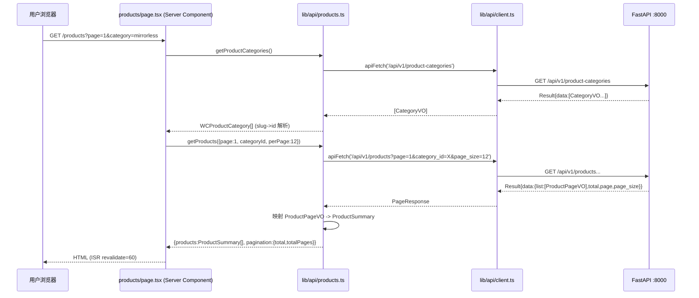

# 前端官网 × 自研 FastAPI 后端 对接方案与任务分解

> 作者：高见远（架构师） ｜ 范围：只读接口对接（产品/资讯/搜索），展示 WordPress 迁来的真实数据
> 说明：本文所有结论均来自**亲读源码**（backend routers/schemas/models、frontend pages/lib），非凭记忆。
> 后端根：`backend/` ｜ 前端根：`frontend/`（代码在根目录，非 src/）

> ⚠️ **文档状态（2026-08 更新）**：本文是 **WordPress → FastAPI 迁移方案的原始设计稿**，迁移**已完成**，不得作为当前部署、认证或 CORS 配置依据。
> `lib/wordpress.ts` 已删除，前端全面改用 `lib/api/*`（products / news / search）对接自研 FastAPI（`:8000`，前缀 `/api/v1`）。
> 文中「当前数据来自 `lib/wordpress.ts`」「待明确 #1~#7」等为**迁移前状态**，对应问题（列表封面图 `cover_image`、搜索结果页、相邻文章、banner 静态化等）均已落地。下方保留为历史设计记录，最新架构以 `frontend/AGENTS.md`、`backend/AGENTS.md` 及根 `README.md`「前端优化与美化」小节为准。

---

## 0. 关键结论速览（先读这段）

| # | 结论 | 影响 |
|---|------|------|
| 1 | （迁移前状态）四个展示页数据曾全部来自 `lib/wordpress.ts`（实时调 WP/WC REST）；**现已完成迁移**，改用 `lib/api/*` 对接自研 FastAPI | 对应工作已完成：`wordpress.ts` 已删除，见 `frontend/AGENTS.md` |
| 2 | 后端端口 **8000**（`common/config.py` 默认 & `.env` PORT=8000），路由前缀 **`/api/v1`**，静态图 `/uploads`（`media_url`）。CORS 全开 | 前端 baseURL = `http://localhost:8000` |
| 3 | ⚠️ **公开 VO（ProductPageVO / NewsPageVO / SearchItemVO）均不含 `cover_image` 字段**，详情 VO 才有 `galleries[].image_url`。列表/搜索页**拿不到封面图** | 本轮最大阻塞点，需后端补 `cover_image` 或前端用占位（见待明确 #1） |
| 4 | 后端分页字段名是 **`list`**（非 `items`），外层包 **`Result{code,msg,msgI18n,data,traceId,timestamp}`**，成功 `code="0"` | API client 必须解 Result + 把 `list` 映射成前端 `{total,totalPages}` |
| 5 | 后端产品/资讯**仅单个分类（FK）**，前端类型期望 `categories: WCProductCategory[]`（数组） | 映射时把单个 category 包成 `[category]` |
| 6 | 后端**无**「上一篇/下一篇」「banner 图」「全量 slug」接口 | 见待明确 #2/#3/#4 |
| 7 | 前端 `/search` 结果页**不存在**（仅 layout 有路由进度条，无功能搜索入口） | 本轮搜索需新增结果页（待明确 #6） |

---

## 1. 前端数据现状结论（基于亲读文件）

### 1.1 各展示页面真实数据源（附证据）

| 页面文件 | 数据源 | 证据（行号） |
|---------|--------|------|
| `app/products/page.tsx` | `lib/wordpress.ts` → `getProducts()` / `getProductCategories()` | L14 import；L58 `getProducts`；L52 `getProductCategories` |
| `app/products/[slug]/page.tsx` | `getProductBySlug` / `getAllProductSlugs` / `getProducts` | L15 import；L129 `getProductBySlug`；L28 `getAllProductSlugs` |
| `app/news/page.tsx` | `getPosts()` | L12 import；L36 `getPosts` |
| `app/news/[slug]/page.tsx` | `getPostBySlug` / `getAllPostSlugs` / `getPosts` / `getAdjacentPosts` | L15 import；L56 `getPostBySlug`；L84 `getAdjacentPosts` |
| `app/page.tsx`（首页） | `getPosts` / `getProducts` / `getProductCategories` / `getSiteBanner`（WP 页面 home-banner） | L24 import；L54 `getSiteBanner`；L60/71/173 |
| `lib/site-config.ts` | `content-data.ts` 的 `COMPANY` / `PRODUCT_CATEGORIES`（导航/页脚） | L9 import；L39-45 |

**结论（迁移前）**：产品/资讯/搜索数据曾全部经 `lib/wordpress.ts` 实时拉 WP；**迁移后**真实数据改由 `lib/api/*` 取自 FastAPI，`content-data.ts` 仍提供站点级静态内容（公司信息、分类展示名、优势、信任条、首页文案）。

### 1.2 `content-data.ts` 中产品/资讯相关字段清单（与后端 schema 逐字段对比）

前端**应用层类型**（`lib/types.ts`）与后端 VO 的逐字段对比：

#### 产品列表 `ProductSummary` ↔ `ProductPageVO`

| 前端字段 | 后端字段 | 对比 |
|---------|---------|------|
| `id` | `id` | ✅ 完全匹配 |
| `slug` | `slug` | ✅ 匹配 |
| `name` | `title` | 🔁 名称不同，需映射 `title→name` |
| `shortDescription` | `summary` | 🔁 `summary→shortDescription` |
| `price` | `price`(Decimal) | 🔁 类型不同（number→string，`String(price??"")`）；后端无 `regularPrice/salePrice/onSale` |
| `regularPrice`/`salePrice`/`onSale` | — | ⬛ 后端无，前端填空/`false` |
| `featured` | — | ⬛ 后端无，前端 `false` |
| `image` | `cover_image` | ⚠️ **后端 VO 未暴露 `cover_image`**（模型有该列但未序列化）→ 本轮缺口 |
| `imageAlt` | — | ⬛ 列表 VO 无 alt |
| `categories` (数组) | `category` (单对象) | 🔁 单对象 → 包成 `[category]` |
| `tags` | — | ⬛ 后端无 tags，前端 `[]` |
| `stockStatus` | `stock_status` | 🔁 重命名 |

#### 产品详情 `ProductDetail` ↔ `ProductDetailVO`

| 前端字段 | 后端字段 | 对比 |
|---------|---------|------|
| `description` | `content_html` | 🔁 重命名 |
| `shortDescription` | `summary` | 🔁 |
| `priceHtml` / `regularPrice` / `salePrice` | `price` | ⬛ 仅 `price`，其余填空 |
| `sku` | `sku` | ✅ |
| `images` (WCProductImage[]) | `galleries[].image_url` | 🔁 由 `GalleryVO` 组装；若有 `cover_image` 置为首图 |
| `gallery` | `galleries` | 🔁 |
| `categories` | `category` | 🔁 单→数组 |
| `tags` | — | ⬛ `[]` |
| `attributes` (WCAttribute[]) | `attributes[]` (AttributeVO{name,slug,value}) | ✅ 结构一致可直接映射 |
| `relatedIds` | — | ⬛ `[]` |
| `stockStatus` | `stock_status` | 🔁 |
| `dateModified` | `updated_time` | 🔁 |

#### 资讯列表 `PostSummary` ↔ `NewsPageVO`

| 前端字段 | 后端字段 | 对比 |
|---------|---------|------|
| `id`/`slug`/`title` | `id`/`slug`/`title` | ✅ |
| `excerpt` | `summary` | 🔁 |
| `featuredImage` | `cover_image` | ⚠️ **VO 未暴露**（缺口） |
| `featuredImageAlt` | — | ⬛ `""` |
| `date` | `published_at`(或 `created_time`) | 🔁 格式化 |
| `author` | `author`(可 null) | 🔁 null→`"Admin"` |
| `categories` | `category` | 🔁 单→数组 |

#### 资讯详情 `PostDetail` ↔ `NewsDetailVO`

| 前端字段 | 后端字段 | 对比 |
|---------|---------|------|
| `content` | `content_html` | 🔁 |
| `modified` | `updated_time`(或 `created_time`) | 🔁 |
| `authorAvatar` | — | ⬛ `""` |
| `tags` | — | ⬛ `[]` |
| 其余 | 同列表 | — |

**小结**：字段命名差异集中在 `title/name`、`summary/shortDescription`、`content_html/description`、`stock_status/stockStatus`、`category/categories[]`；后端缺 `cover_image`（列表/搜索）、`tags`、`price` 多价、相邻文章、banner。映射层放在 `lib/api/*` 内完成，页面组件几乎不改动。

### 1.3 `types.ts` 类型摘录（当前页面消费的应用层类型）

- `ProductSummary`：`{id, slug, name, shortDescription, price, regularPrice, salePrice, onSale, featured, image, imageAlt, categories: WCProductCategory[], tags: WCProductTag[], stockStatus}`
- `ProductDetail`：在 Summary 基础上 + `{description, priceHtml, sku, images: WCProductImage[], gallery: WCProductImage[], attributes: WCAttribute[], relatedIds, dateModified}`
- `PostSummary`：`{id, slug, title, excerpt, featuredImage, featuredImageAlt, date, author, categories: {id,name,slug}[]}`
- `PostDetail`：在 Summary 基础上 + `{content, modified, authorAvatar, tags}`
- `WCProductCategory`：`{id, name, slug}` ｜ `WCProductImage`：`{id, date_created, src, name, alt}` ｜ `WCAttribute`：`{name, slug, value}` ｜ `WPPagination`：`{total, totalPages}`

> 结论：继续**复用**这些应用层类型作为页面与 API client 之间的契约，新增 `lib/api/types.ts` 仅放「后端原始 VO」类型与映射函数，避免改动任何页面/组件。

---

## 2. 后端接口真实响应结构（亲读 routers/schemas）

所有接口前缀 `/api/v1`，统一返回 `Result`：
```jsonc
{ "code": "0", "msg": "ok", "msgI18n": {}, "data": <T>, "traceId": "...", "timestamp": "2025-..." }
// 业务失败：code="A010001" 等（HTTP 仍 200）；校验失败 HTTP 400 C400001
```
分页响应 `PageResponse`：`{ "list": [...], "total": N, "page": 1, "page_size": 20 }`（注意是 `list` 不是 `items`）。

| 接口 | Query 参数 | data 结构 | 图片字段 | 分类字段 |
|------|-----------|-----------|---------|---------|
| `GET /products` | `page`(默认1) `page_size`(默认20,≤50) `order_by`(默认`-created_time`) `category_id`(int?) `status`(默认PUBLISHED) `keyword` | `PageResponse<ProductPageVO>` | ⚠️ **VO 无 cover_image**；详情才有 `galleries[].image_url` | `category: CategoryVO\|null`（单） |
| `GET /products/{slug}` | — | `ProductDetailVO`：`+ content_html, galleries[], attributes[]` | `galleries[].image_url`（相对 `/uploads/products/{slug}/...`） | 同 |
| `GET /product-categories` | — | `CategoryVO[]`：`{id,name,slug,sort_order}` | — | — |
| `GET /news` | 同 `/products`（多 `category_id`/`status`/`keyword`） | `PageResponse<NewsPageVO>` | ⚠️ **VO 无 cover_image** | `category: NewsCategoryVO\|null` |
| `GET /news/{slug}` | — | `NewsDetailVO`：`+ content_html` | ⚠️ **VO 无 cover_image** | 同 |
| `GET /news-categories` | — | `NewsCategoryVO[]`：`{id,name,slug,sort_order}` | — | — |
| `GET /search` | `q`(必填,≤100) `type`(all/product/news) `page`(≥1) `page_size`(1–50) | `SearchPageVO`：`{items:SearchItemVO[], total, took_ms, degraded, note}` | ⚠️ **item 无 cover_image** | — |
| `POST /inquiries` | body | 询盘提交（本轮不强求） | — | — |

**SearchItemVO**：`{id, kind:"product"|"news", title, summary, slug, url:"/products/{slug}", rank}`（无 cover_image、无 categories）。

**图片物理与对外 URL**（已核实 `backend/uploads/` 目录 + `migrate_uploads_to_slug.py`）：
- 产品：`uploads/products/{slug}/cover.webp`（扩展名有 `.webp/.jpg/.png` 混用）
- 资讯：`uploads/news/{slug}/cover.webp`（同上）
- 模型 `cover_image` 列存**相对路径**如 `/uploads/products/{slug}/cover.webp`；`galleries.image_url` 亦是相对路径
- 对外：`http://<host>:<port>/uploads/...`（已 `app.mount(settings.media_url, StaticFiles(...))`）

---

## 3. 前端 API 对接技术方案（推荐 + 理由）

### 3.1 API client 封装方案

> 新建目录 `lib/api/`，**不改动**现有页面组件与 `lib/types.ts` 的应用层类型。

| 文件 | 职责 |
|------|------|
| `lib/api/client.ts` | `API_BASE` 读 `NEXT_PUBLIC_API_URL`；`apiFetch<T>(path, {revalidate})` 封装 fetch：超时(AbortController 15s) + 解 `Result`（`code!=="0"` 抛 `Error(msg)`）+ 返回 `data`；支持 Next `next:{revalidate}` 做 ISR；统一错误处理（见 §5） |
| `lib/api/types.ts` | 只放后端原始 VO 类型：`ProductPageVO/ProductDetailVO/CategoryVO/GalleryVO/AttributeVO/NewsPageVO/NewsDetailVO/NewsCategoryVO/SearchItemVO/SearchPageVO/PageResponse<T>` + `Result<T>` |
| `lib/api/products.ts` | `getProducts({page,perPage,categoryId?,search?})` → `{products:ProductSummary[], pagination:WPPagination\|null}`；`getProductBySlug(slug)` → `ProductDetail\|null`；`getProductCategories()` → `WCProductCategory[]`；`getAllProductSlugs()`（分页聚合，见待明确#4） |
| `lib/api/news.ts` | `getPosts({page,perPage,categoryId?,search?})` → `{posts:PostSummary[], pagination}`；`getPostBySlug(slug)` → `PostDetail\|null`；`getNewsCategories()` → `WCProductCategory[]`；`getAdjacentPosts(slug)`（前端自算，见#2） |
| `lib/api/search.ts` | `search({q,type,page,pageSize})` → `{items: 映射后结果[], total, degraded}` |

**映射放哪一层**：在 `products.ts` / `news.ts` 内把后端 VO → 应用层 `ProductSummary/Detail`、`PostSummary/Detail`（见 §1.2 对照表）。页面组件零改动。
**与现有 `lib/wordpress.ts` 的关系**：本轮**不再调用 WP**。方案 A（推荐）：新建 `lib/api/*` 并在页面把 `import ... from "@/lib/wordpress"` 改为 `@/lib/api/products|news|search`；保留 `wordpress.ts` 与 `formatDate`（被 news.ts 复用）暂不删，避免误伤。方案 B：在 `wordpress.ts` 内直接改实现——不推荐（污染语义）。（注：`wordpress.ts` 已于 2026-07-27 删除，相关页面已全面改用 `lib/api/*`，见文首状态横幅。）

### 3.2 Next.js App Router 数据获取策略

**推荐：保持现状 —— Async Server Component + `await` 直接读后端 + ISR（`revalidate=60`）**。
- 理由：① 现有 4 个页面本就是 Server Component 直接 `await getProducts(...)`，改为后端只是换了取数函数，渲染逻辑/SEO/metadata 全保留；② 产品/资讯详情仍用 `generateStaticParams` + `dynamicParams=true` 保证 SEO；③ 后端已带 Redis 缓存（详情 300s、搜索 60s），前端 ISR 60s 叠加足够；④ 无需引入 Client Component / SWR（列表无交互筛选需求，分类筛选用 URL searchParams 在 Server 端完成）。
- `revalidate`：保持各页现有 `export const revalidate = 60`（与 WP 时代一致）。
- `generateStaticParams`：`getAllProductSlugs`/`getAllPostSlugs` 改为从后端分页聚合（见待明确#4），失败返回 `[]` 并设 `export const dynamicParams = true`，缺失 slug 走按需 SSR+ISR。

### 3.3 图片接入方案

| 方案 | 做法 | 评价 |
|------|------|------|
| **A（推荐）remotePatterns + 绝对 URL** | `next.config.ts` 的 `images.remotePatterns` 增加 `{protocol:"http", hostname:"localhost", port:"8000", pathname:"/**"}`（生产换成后端域名）；前端用绝对地址 `https://<API_HOST>/uploads/...` | 显式、可控、不受 rewrite 缓存副作用影响 |
| B（备选）rewrites 代理 | `next.config.ts` 加 `async rewrites(){return[{source:"/uploads/:path*", destination:"\${API_URL}/uploads/:path*"}]}`；前端用相对 `/uploads/...` | 同源、不暴露后端域名；但静态资源走 optimizer 代理需注意缓存 |
| C | 直接用 `` | 放弃 Next 图片优化，不推荐 |

**推荐 A**。配合：把后端返回的相对路径 `cover_image`/`image_url` 在 client 内拼成绝对 URL（`resolveImage(rel)` = `API_BASE + rel`）。
⚠️ 前置条件：**后端必须把 `cover_image` 加回公开 VO**（待明确#1），否则列表/搜索无图，只能用占位。

### 3.4 环境变量

- 新增 `NEXT_PUBLIC_API_URL=http://localhost:8000`（`.env.example` + 本地 `.env`）。
- `NEXT_PUBLIC_WORDPRESS_URL`：**本轮保留但降级**——仅 `lib/media.ts` 的 `MEDIA.heroBanner` 等页面级静态图仍可能引用；产品/资讯图不再用它。待 WP 下线后把 `MEDIA` 资源迁到 `public/` 或后端（待明确#7）。
- `NEXT_PUBLIC_ISR_REVALIDATE` 保留（默认 60）。

### 3.5 `next.config.ts` 需要调整

1. `images.remotePatterns` 增加后端 host:port（方案 A）；或加 `rewrites`（方案 B）。
2. 其余（redirects、turbopack、compress 等）**不变**。

### 3.6 类型对齐策略

- **复用** `lib/types.ts` 的 `ProductSummary/ProductDetail/PostSummary/PostDetail/WCProductCategory/WCProductImage/WCAttribute/WPPagination` 作为页面契约。
- **新增** `lib/api/types.ts` 放后端原始 VO + `Result` 类型。
- **映射**集中在 `lib/api/products.ts` / `news.ts` / `search.ts` 内部函数，页面无感。

---

## 4. 任务分解列表（有序 · 含依赖 · 按实现顺序）

> 本轮范围：产品列表/详情、资讯列表/详情、搜索、首页相关区块用真实数据渲染。contact 询盘提交标为下轮。
> 每个任务含【文件】【改动内容】【依赖】【验收标准】。

### T01 — 基础设施：API client 基底 + 类型 + 环境变量
- **文件**：`lib/api/client.ts`（新建）、`lib/api/types.ts`（新建）、`frontend/.env.example`（改）、`frontend/.env`（改）、`next.config.ts`（改 remotePatterns/rewrites）
- **改动内容**：
  - `client.ts`：`API_BASE=process.env.NEXT_PUBLIC_API_URL||"http://localhost:8000"`；`apiFetch` 解 `Result`、超时、ISR revalidate、统一错误。
  - `types.ts`：后端 VO 类型 + `Result<T>` + `PageResponse<T>`。
  - 新增 `NEXT_PUBLIC_API_URL=http://localhost:8000`。
  - `next.config.ts` 增加后端图片域（方案 A）或 rewrites（方案 B）。
- **依赖**：无（前置；需后端在 8000 启动）
- **验收**：`apiFetch('/api/v1/product-categories')` 在 Server Component 内能拿到 `data` 数组；`next build`/`next dev` 不报远程图片域名错误。

### T02 — 产品数据对接（列表/详情/分类/SSG）
- **文件**：`lib/api/products.ts`（新建）、`app/products/page.tsx`（改 import+分类 slug→id 映射）、`app/products/[slug]/page.tsx`（改 import；用 `galleries` 渲染图集；`dynamicParams=true`）
- **改动内容**：
  - `products.ts`：实现 `getProducts/getProductBySlug/getProductCategories/getAllProductSlugs`，把 `ProductPageVO/DetailVO` 映射成 `ProductSummary/Detail`（单 category→数组、`price`→string、`cover_image`→`image` 若有、`galleries`→`images`）。
  - 列表页：把 `category` slug 经 `getProductCategories()` 解析为 `category_id` 再传 `getProducts`。
  - 详情页：`generateStaticParams` 改用 `getAllProductSlugs`；`dynamicParams=true`；`ProductGallery` 用 `images/gallery`。
- **依赖**：T01
- **验收**：`/products` 与 `/products/{slug}` 用后端数据正常渲染；分页/分类筛选可用；`revalidate=60` 生效。

### T03 — 资讯数据对接（列表/详情/分类/相邻/SSG）
- **文件**：`lib/api/news.ts`（新建）、`app/news/page.tsx`（改 import）、`app/news/[slug]/page.tsx`（改 import；`getAdjacentPosts` 前端自算；`dynamicParams=true`）
- **改动内容**：
  - `news.ts`：`getPosts/getPostBySlug/getNewsCategories/getAllPostSlugs` 映射 `NewsPageVO/DetailVO`→`PostSummary/Detail`；`getAdjacentPosts` 用 `getPosts` 全量按时间排序算 prev/next（待明确#2）。
  - 详情页：`generateStaticParams`/`dynamicParams=true`；`featuredImage` 取 `cover_image`（若有）。
- **依赖**：T01
- **验收**：`/news` 与 `/news/{slug}` 正常渲染；上一篇/下一篇可用（或按决策隐藏）；分页可用。

### T04 — 搜索对接（API + 结果页）
- **文件**：`lib/api/search.ts`（新建）、`app/search/page.tsx`（新建结果页）、搜索入口组件（改，接 `/api/v1/search`）、`lib/api/types.ts`（已含 SearchItemVO）
- **改动内容**：
  - `search.ts`：`search({q,type,page,pageSize})` 调 `/api/v1/search`，映射 `SearchItemVO`→卡片数据（`href=url`）。
  - 新建 `/search` 结果页（Server Component，读取 `?q=`），展示产品/资讯混合结果；搜索框提交到 `/search?q=`。
- **依赖**：T01（结果页 UI 范围见待明确#6）
- **验收**：输入关键词可在 `/search` 看到产品+资讯结果；空关键词走后端 `A030001` 友好提示。

### T05 — 首页真实数据区块接入
- **文件**：`app/page.tsx`（改 import：`getPosts/getProducts/getProductCategories` → `lib/api/*`）、`lib/api/products.ts`/`news.ts`（已在 T02/T03 实现）、`lib/media.ts`（Hero 图源处理，见待明确#3）
- **改动内容**：
  - 首页 `ProductCategoriesSection`/`NewsSection` 改用 `lib/api` 取数；`getSiteBanner` 改为返回 `null` 让 `HeroSection` 回退到本地 `MEDIA.heroBanner`（需把 banner 移到 `public/`，或保留 WP_URL 临时兼容）。
- **依赖**：T02、T03
- **验收**：首页产品类目/最新资讯用后端真实数据；Hero 有图（本地资源）。

### T06（下轮/可选）— 询盘提交对接 `POST /inquiries`
- **文件**：`lib/inquiry-service.ts`（改）、`app/contact/page.tsx`（改）
- **改动内容**：把本地写 `data/inquiries.json` 改为调 `POST /api/v1/inquiries`（需确认该接口请求/响应结构，本轮未读 inquiry 写接口）。
- **依赖**：T01
- **验收**：联系页提交询盘直达后端。

---

## 5. 共享知识（跨文件约定）

- **Base URL 变量**：统一 `process.env.NEXT_PUBLIC_API_URL`（默认 `http://localhost:8000`）；所有请求经 `lib/api/client.ts` 的 `apiFetch`，**不要**在页面里直接 `fetch`。
- **错误处理约定**：`apiFetch` 检测 `Result.code !== "0"` → `throw new Error(result.msg)`；页面/组件用 `.catch(()=>({products:[],pagination:null}))` 兜底（沿用现有 WP 容错风格）。列表类函数失败返回空数组而非抛错，保证页面不白屏。
- **类型命名约定**：后端原始类型放 `lib/api/types.ts`（后缀 `VO`）；应用层类型放 `lib/types.ts`（`ProductSummary/Detail`、`PostSummary/Detail` 等），**页面只认应用层类型**。
- **图片 URL 约定**：后端返回相对路径（`/uploads/...`）；经 `resolveImage(rel) = API_BASE + rel` 转绝对 URL 再交给 `next/image`；封面取值优先级：详情=`cover_image` or `galleries[0].image_url`，列表/搜索=依赖后端补 `cover_image`（否则占位）。
- **分页约定**：前端 `WPPagination={total,totalPages}`，由后端 `PageResponse{list,total,page,page_size}` 换算：`totalPages=Math.ceil(total/page_size)`。
- **ISR 约定**：各数据页 `revalidate=60`；`generateStaticParams` 失败返回 `[]` 且 `dynamicParams=true`。
- **分类筛选约定**：前端用 slug，调用前先 `get*Categories()` 把 slug→id，再传后端 `category_id`。

---

## 6. 待明确事项（需主理人/用户确认）

1. **【最关键】`cover_image` 不在公开 VO** —— 需后端在 `product/schemas.py` 的 `ProductPageVO/NewsPageVO.from_model` 与 `search/schemas.py` 的 `SearchItemVO` 补 `cover_image`（返回相对路径 `/uploads/{type}/{slug}/cover.webp`）。**是否由后端工程师在本轮补？** 若不补，列表/搜索/首页类目卡只能用占位图，产品详情可用 `galleries[0]`。
2. **新闻上一篇/下一篇** —— 后端无相邻文章接口。方案：前端在 `news.ts` 用 `getPosts` 全量排序自算（数据量小，可接受）；或后端新增接口。请确认是否接受前端自算。
3. **首页 Hero 图源（`getSiteBanner`）** —— 后端无 banner 端点。建议本轮把 `banner.webp` 移到 `frontend/public/`，`MEDIA.heroBanner` 改本地路径；或保留 `NEXT_PUBLIC_WORDPRESS_URL` 仅给 `MEDIA` 用（临时）。请确认。
4. **`getAll*Slugs`（SSG）** —— 后端无专门接口，`page_size` 上限 50。建议：`dynamicParams=true` + 分页聚合（循环到 `total`）；或干脆放弃严格 SSG 改纯 ISR 按需渲染。请确认偏好。
5. **分类筛选 UI 是否保留** —— 现有产品列表有 6 列分类筛选（按 slug）。建议保留，映射改为 slug→`category_id`。是否要做资讯分类筛选？
6. **搜索框 UI 改动范围** —— 当前无功能搜索结果页。建议本轮新增 `/search` 页 + 一个搜索入口（header 或首页）。请确认搜索入口位置与是否进本轮。
7. **`NEXT_PUBLIC_WORDPRESS_URL` 废弃策略** —— 本轮产品/资讯不再调 WP；`MEDIA.ts` 与 `getSiteBanner` 仍可能引用。是否保留该变量做 `MEDIA` 兼容，还是一并把静态资源迁到 `public/` 或后端？
8. **是否保留 `content-data.ts` 作为 fallback** —— 当前静态区块（COMPANY/STRENGTHS 等）仍用它，无需改；产品/资讯数据改为后端优先、**不再调用 WP**。是否需保留 WP 作为降级源？（建议：不保留，直接替换。）

---

## 附录 A：产品列表页 SSR 渲染流程（Sequence）



## 附录 B：lib/api 模块与类型映射（Class）

```mermaid
classDiagram
    class client {
        +API_BASE: string
        +apiFetch(path, opts): Promise~any~
    }
    class products_api {
        +getProducts(params): {products:ProductSummary[], pagination}
        +getProductBySlug(slug): ProductDetail|null
        +getProductCategories(): WCProductCategory[]
        +getAllProductSlugs(): string[]
    }
    class news_api {
        +getPosts(params): {posts:PostSummary[], pagination}
        +getPostBySlug(slug): PostDetail|null
        +getNewsCategories(): WCProductCategory[]
        +getAdjacentPosts(slug): {prev,next}
    }
    class search_api {
        +search(params): {items, total, degraded}
    }
    class ProductPageVO {
        +id: int
        +slug: string
        +title: string
        +summary: string
        +sku: string
        +price: number
        +stock_status: string
        +category: CategoryVO
    }
    class ProductDetailVO {
        +content_html: string
        +galleries: GalleryVO[]
        +attributes: AttributeVO[]
    }
    class NewsPageVO {
        +author: string
        +published_at: string
        +category: NewsCategoryVO
    }
    class ProductSummary {
        +name: string
        +shortDescription: string
        +image: string
        +categories: WCProductCategory[]
        +stockStatus: string
    }
    class PostSummary {
        +excerpt: string
        +featuredImage: string
        +date: string
    }
    client <.. products_api : uses
    client <.. news_api : uses
    client <.. search_api : uses
    ProductPageVO <|-- ProductDetailVO
    ProductPageVO ..> ProductSummary : map
    NewsPageVO ..> PostSummary : map
```
## 当前代码对照（2026-08-13）

本文保留为前端与 FastAPI 对接的历史设计记录。产品、新闻、询盘和分类对接已经落地；当前询盘还包含国家、产品来源、落地页、来源页和 UTM 归因，后台通知由独立接口提供。原文中的“下轮/可选询盘提交”任务已完成，不应当作待办。以 [`CURRENT_IMPLEMENTATION.md`](../../CURRENT_IMPLEMENTATION.md)、`frontend/README.md` 和实际 `frontend/lib/api/` 代码为准。
