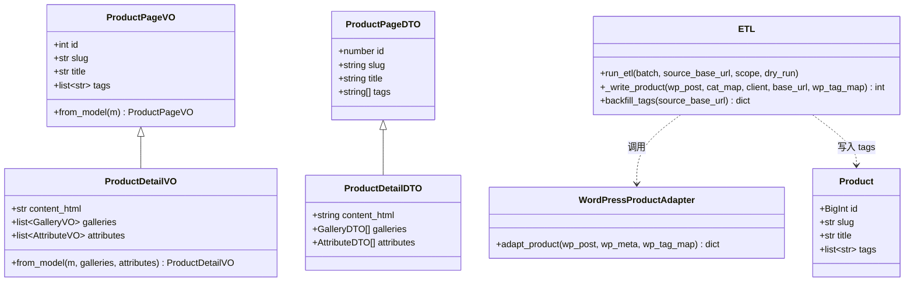
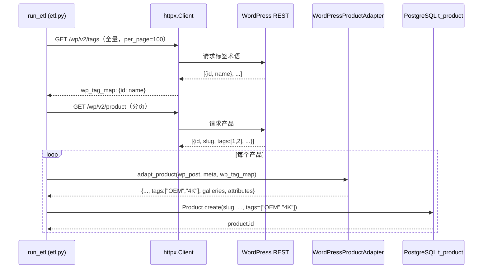
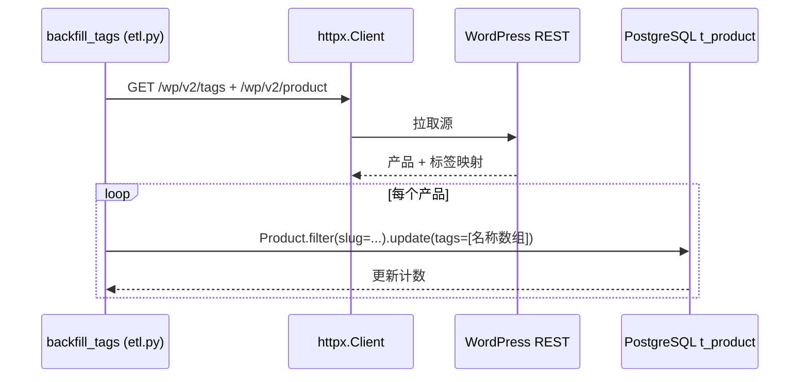
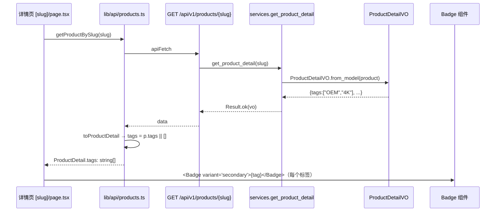
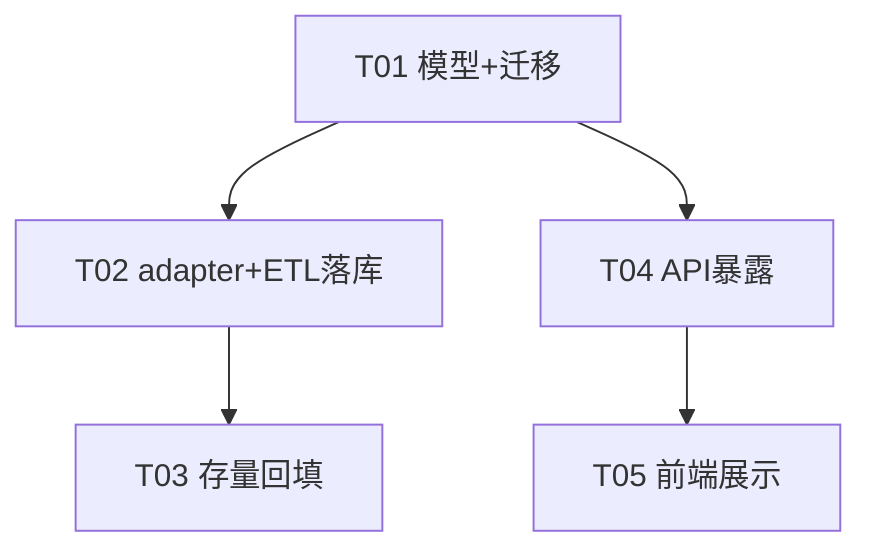

# 恢复 WordPress 产品标签（product tags）方案与任务清单

> 作者：架构师 高见远（software-architect）
> 范围：Desktop 真实副本 `full-stack-project`（backend = FastAPI + Tortoise ORM + aerich + Postgres；frontend = Next.js + shadcn/ui）
> 目标：让产品页重新展示 WP 产品标签。根因是 `product_tag` 分类法从未被迁移——现有 adapter 只搬了 `product_cat`（分类）与 `wc_attributes`（属性），标签压根没同步。本方案覆盖：adapter 抓取 → 模型/字段 → ETL 落库 → 存量回填 → API 暴露 → 前端展示。

---

## 一、实现方案与框架/库选型

### 1.1 背景确认（已调研）

| 点 | 现状（来自真实代码） |
|----|----------------------|
| `product/models.py` | `Product` 继承自 `TimestampedMixin, SoftDeleteMixin, AuditByMixin`，**无 tags 字段**；仅有 `ProductAttribute`（来自 `wc_attributes`）。 |
| `migration/wp_adapter.py` | `adapt_product()` 已是最先进 `wc_*` 版本，返回 `title/slug/summary/content_html/sku/price/stock_status/wp_category_id/cover_media_id/created_time/galleries/attributes`。**不返回 tags**。WP 产品的标签在 REST 中通常是顶层 `tags: number[]`（标签 ID 数组），名称需另取 `/wp/v2/tags?include=1,2,3`。 |
| `migration/etl.py` | `_write_product()` 逐条 `Product.create(...)`，不在事务里（注释明确说明为容错搜索向量而逐条提交）。接收 adapter 的 dict 后 `pop` 出 `created_time / wp_category_id / cover_media_id` 再写入。 |
| `migration/backfill.py` | 已有 `backfill_created_time()` 入口（按 slug 匹配 `.update()`），可扩展或新增一步补 tags。 |
| `product/schemas.py` | `ProductPageVO` / `ProductDetailVO` 由 `from_model` 装配；详情 VO 现无 tags。 |
| `aerich.ini` | 迁移工具为 **aerich**，模型快照在 `migrations/models/`，已有 `0_init`、`1_add_cover_image`、`2_add_news_cover_image` 三个迁移。新增字段后执行 `aerich migrate` 即可生成 `3_*.py`。**迁移必须跑在用户 Postgres 上，本环境不跑。** |
| 前端 | `lib/types.ts` 里 `ProductSummary.tags` / `ProductDetail.tags` 当前被声明为 `WCProductTag[]`（`{id,name,slug}`）；但 `lib/api/products.ts` 的 mapper 里 `tags: []` 被**硬编码为空**，且 `ProductCard.tsx` 与 `app/products/[slug]/page.tsx` 已预留了 `product.tags.map(...)` 渲染位（只是空）。`components/ui/badge.tsx` shadcn Badge **已存在**。 |

### 1.2 技术选型

- **不引入新框架/库**：后端沿用 FastAPI + Tortoise ORM + aerich；前端沿用 Next.js + shadcn `Badge`。
- **迁移工具**：aerich（Postgres 目标环境执行）。
- **字段存储选型（核心决策，见 1.3）**：推荐 **Tortoise `JSONField` 存 `list[str]`（标签名字符串数组）**，而非 `CharField` 逗号分隔，也暂不采用正规 M2M。
- **标签名解析**：在 ETL `run_etl` 阶段对 `/wp/v2/tags` 做一次全量拉取，建立 `wp_tag_id → name` 映射，随产品写入；adapter 保持纯函数（只做数据转换，不触网）。

### 1.3 数据模型决策

#### ✅ 推荐方案：在 `Product` 上增加扁平字段 `tags`

```python
# product/models.py
tags = fields.JSONField(null=True, default=list)  # 标签名字符串数组，如 ["OEM", "4K", "Waterproof"]
```

**理由：**
1. **WP 产品标签是非层级、低基数（单品通常 0–10 个）的展示型分类法**，当前需求只是"展示"，不需要"按标签筛选/聚合/导航"。
2. **单条 `ALTER TABLE` 即可上线**，无新模型、无联结表、无标签 CRUD API，迁移与回滚都最简单。
3. **存名称而非 ID**：迁移时在 ETL 里就把 ID 解析成名称落库，读路径零额外 join、零名称解析服务；名称直接进 VO。
4. **`JSONField` 优于 `CharField` 逗号分隔**：原生数组，无需 split/拼接；标签名可能含逗号，逗号分隔有歧义与编码坑；`model_dump(mode="json")` 自动序列化；Postgres 下为 `JSONB`，查询/索引友好。SQLite（本地开发）自动降级为 `TEXT`，不破坏 `generate_schemas`。
5. **aerich 零成本**：改完 `models.py` 跑 `aerich migrate` 即生成 `ALTER TABLE "t_product" ADD "tags" JSONB;`。

#### 🟡 备选方案：正规 M2M（`ProductTag` 模型 + `ManyToManyField`）

```python
class ProductTag(TimestampedMixin, SoftDeleteMixin, Model):
    id = fields.BigIntField(primary_key=True)
    name = fields.CharField(max_length=100)
    slug = fields.CharField(max_length=100, unique=True)
    products: fields.ManyToManyRelation[Product]

# Product.tags: fields.ManyToManyField("models.ProductTag", related_name="products")
```

**为何默认不优先：**
- 多步迁移（新建 `t_product_tag` + 联结表）。
- ETL 需为每品的 N 个标签 `get_or_create`（或批量插入联结），写放大。
- 读路径需 `prefetch_related("tags")`（额外 join）并在 VO 装配标签列表。
- 当前范围只要求"展示"，上 M2M 属于 YAGNI。
- **何时升级到 M2M**：若后续要做"标签聚合页 / 按标签筛选 / 标签自动补全"等需按标签反查产品的功能，再重构为 M2M（届时迁移脚本把 `tags` JSON 展开写入联结表即可）。

---

## 二、文件清单（相对 backend/ 与 frontend/）

### 后端（backend/）
| 文件 | 变更 |
|------|------|
| `product/models.py` | `Product` 新增 `tags = fields.JSONField(null=True, default=list)` |
| `migrations/models/3_*.py` | **由 aerich 生成**（本环境不跑）：`ALTER TABLE "t_product" ADD "tags" JSONB;` + 对应 downgrade |
| `migration/wp_adapter.py` | `adapt_product()` 新增可选参数 `wp_tag_map`，把 WP `tags` ID 数组解析为名称字符串数组并入返回 dict |
| `migration/etl.py` | `run_etl` 增加一次性拉取 `/wp/v2/tags` 建映射并透传；`_write_product` 把 `tags` 落库；新增 `backfill_tags()` |
| `migration/backfill.py` | `_main` 在 `backfill_created_time` 之后调用 `backfill_tags`（复用同一 `WP_SOURCE_BASE_URL`） |
| `product/schemas.py` | `ProductPageVO` 与 `ProductDetailVO` 增加 `tags: list[str]` 字段并在 `from_model` 装配 |
| `aerich.ini` | 已存在，**无需改动**（仅作为迁移生成依据被引用） |

### 前端（frontend/）
| 文件 | 变更 |
|------|------|
| `lib/api/client.ts` | `ProductPageDTO` / `ProductDetailDTO` 增加 `tags: string[]` |
| `lib/types.ts` | `ProductSummary.tags` / `ProductDetail.tags` 由 `WCProductTag[]` 改为 `string[]`（与后端契约对齐） |
| `lib/api/products.ts` | `toProductSummary` / `toProductDetail` 的 `tags` 由硬编码 `[]` 改为读 `p.tags || []` |
| `app/products/[slug]/page.tsx` | 详情页标签区改用 `<Badge>` 渲染 `string[]`（去掉 `tag.id/tag.name`，改用 `tag` 本身，`key={tag}`） |
| `components/ProductCard.tsx` | 卡片标签区改用 `<Badge>` 渲染 `string[]`（`key={tag}`，最多展示 4 个） |
| `components/ui/badge.tsx` | **无需改动**（已存在，直接用 `variant="secondary"`） |

> 无需新增独立「标签列表」接口——标签随产品详情（及列表 VO）一并返回；当前需求无"按标签浏览"页面。

---

## 三、数据模型 / 接口变更（字段表 + 类图）

### 3.1 字段变更表

**后端模型 `Product`（t_product）**
| 字段 | 类型 | 说明 |
|------|------|------|
| `tags` | `JSONField`（PG→JSONB，SQLite→TEXT） | `null=True, default=list`，存标签名字符串数组 |

**后端 VO**
| VO | 新增字段 | 类型 |
|----|----------|------|
| `ProductPageVO` | `tags` | `list[str]`（列表接口也返回，供卡片 Badge 使用） |
| `ProductDetailVO` | `tags` | `list[str]`（继承自 `ProductPageVO`，`from_model` 自动带出） |

**前端 DTO / 类型**
| 类型 | 新增/变更 | 类型 |
|------|-----------|------|
| `ProductPageDTO` | `tags` | `string[]` |
| `ProductDetailDTO` | `tags` | `string[]` |
| `ProductSummary` | `tags`（`WCProductTag[]` → `string[]`） | `string[]` |
| `ProductDetail` | `tags`（`WCProductTag[]` → `string[]`） | `string[]` |

### 3.2 类图（Mermaid）



---

## 四、调用流程（时序）

### 4.1 迁移/落库：adapter → etl → 库



### 4.2 回填：存量产品补 tags（按 slug `.update()`）



### 4.3 前端：页面 → API → 展示



---

## 五、有序任务清单（依赖关系 + 实现顺序）

> 规则：任务按依赖顺序排列；改哪些文件一目了然。后端模型字段先行，再抓取/落库，再 API 暴露，最后前端展示。回填依赖抓取逻辑复用。

### T01 — 后端模型 + aerich 迁移（P0）
- **依赖**：无
- **源文件**：`product/models.py`、`migrations/models/3_*.py`（由 aerich 生成）、`aerich.ini`（引用，不改）
- **内容**：
  1. `Product` 增加 `tags = fields.JSONField(null=True, default=list)`。
  2. 在用户 Postgres 环境执行：
     ```bash
     cd backend
     aerich migrate --name add_product_tags   # 生成 migrations/models/3_*.py
     aerich upgrade                            # 执行 ALTER TABLE "t_product" ADD "tags" JSONB;
     ```
  3. 本环境只产出方案与模型改动，**不在本机执行迁移**。
- **交付物**：模型改动 + 迁移文件（用户 PG 上 `aerich upgrade` 后 `t_product` 含 `tags` 列）。

### T02 — 后端 adapter 抓取 + ETL 落库（P0）
- **依赖**：T01
- **源文件**：`migration/wp_adapter.py`、`migration/etl.py`
- **内容**：
  1. `wp_adapter.py`：`adapt_product()` 增加可选参数 `wp_tag_map: dict[int,str]|None=None`；读取 `wp_post.get("tags")`（ID 数组），有 map 则解析为名称数组 `["OEM","4K"]`，无 map 兜底存 ID 字符串；并入返回 dict 的 `tags` 键。**不触网、不破坏现有 `wc_*` 逻辑**。
  2. `etl.py`：`run_etl` 在产品拉取前一次性 `GET /wp/v2/tags` 建 `wp_tag_map`（失败仅告警，标签置空）；透传给 `_write_product` → `adapt_product(... , wp_tag_map=wp_tag_map)`；`_write_product` 在 `Product.create(...)` 增加 `tags=data.get("tags", [])`（普通字段，不触发 `auto_now_add`，无时区坑）。

### T03 — 后端存量回填 tags（P1）
- **依赖**：T02（复用标签解析/映射逻辑）
- **源文件**：`migration/etl.py`、`migration/backfill.py`
- **内容**：
  1. `etl.py` 新增 `backfill_tags(source_base_url)`：拉取全部产品 + `/wp/v2/tags` 建映射，按 `slug` 匹配本地行，用 `.update(tags=[名称数组])` 直写（与 `backfill_created_time` 同模式，容错、不触发 `auto_now_add`）。
  2. `backfill.py` 的 `_main` 在 `backfill_created_time` 之后调用 `backfill_tags(url)`，并打印其统计。

### T04 — 后端 API 暴露 tags（P0）
- **依赖**：T01（字段已存在）
- **源文件**：`product/schemas.py`、`lib/api/client.ts`
- **内容**：
  1. `schemas.py`：`ProductPageVO` 与 `ProductDetailVO` 增加 `tags: list[str]`，并在 `ProductPageVO.from_model` 装配 `tags=m.tags`（详情 VO 继承自动带出）。`services.get_product_detail` 经 VO 自动返回，无需改 service 逻辑。
  2. `client.ts`：`ProductPageDTO` / `ProductDetailDTO` 增加 `tags: string[]`（与后端对齐）。
  - 列表接口（`/products`）返回 `ProductPageVO` 即含 tags，供卡片使用；详情接口（`/products/{slug}`）返回 `ProductDetailVO` 含 tags。**无需新增独立标签接口。**

### T05 — 前端类型同步 + Badge 展示（P0）
- **依赖**：T04（DTO 契约确定）
- **源文件**：`lib/types.ts`、`lib/api/products.ts`、`app/products/[slug]/page.tsx`、`components/ProductCard.tsx`
- **内容**：
  1. `types.ts`：`ProductSummary.tags` / `ProductDetail.tags` 由 `WCProductTag[]` 改为 `string[]`。
  2. `products.ts`：`toProductSummary` / `toProductDetail` 的 `tags` 由硬编码 `[]` 改为 `p.tags || []`。
  3. `[slug]/page.tsx`：标签区改用 `<Badge variant="secondary">{tag}</Badge>`（遍历 `string[]`，`key={tag}`），对齐 `DESIGN-tesla.md`（Light Ash 底 + Pewter 字，无阴影）。
  4. `ProductCard.tsx`：卡片标签区同样改用 `<Badge variant="secondary">`（最多 4 个，`key={tag}`）。
  - 视觉调性：沿用 Tesla 设计语言——`variant="secondary"`（≈ `#F4F4F4`/`#5C5E62`），不引入额外颜色与阴影；Badge 默认 `rounded-4xl`（胶囊）与现有标签观感一致。

### 任务依赖图（Mermaid）



---

## 六、依赖包

- **后端**：无需新增包。`JSONField` 为 Tortoise ORM 内置；aerich 已就位。`httpx` 已在 `etl.py` 使用（拉 `/wp/v2/tags` 复用）。
- **前端**：无需新增包。`Badge` 组件（`@base-ui/react` + `class-variance-authority`）已存在。
- 唯一环境动作：在**用户 Postgres** 上执行 `aerich migrate` + `aerich upgrade`（本环境不执行）。

---

## 七、共享约定（跨文件）

1. **字段命名**：统一为 `tags`（后端模型字段、VO 字段、前端 DTO/类型字段名全部一致）。
2. **数据类型契约**：后端 `tags` 为 `list[str]`（标签**名称**字符串数组，非空时形如 `["OEM","4K","Waterproof"]`）；前端对应 `string[]`。**不传标签 ID、不传 `{id,name}` 对象**——保持扁平、无假 ID。
3. **JSON 解析约定**：`JSONField` 由 Tortoise 自动序列化/反序列化；VO 用 `model_dump(mode="json")` 透出数组；前端 `p.tags || []` 兜底空值（DB 为 `NULL` 时）。
4. **空值处理**：产品无标签时返回 `[]`（前端亦按空数组跳过渲染），绝不返回 `null` 到列表/详情展示层（mapper 已兜底）。
5. **命名/注释**：所有新增代码与改动处使用**中文注释**（与现有代码风格一致，如 `tags: 标签名字符串数组`）。
6. **只读扩展**：adapter 保持纯函数、不触网；标签名解析集中在 ETL 的 `wp_tag_map`，避免 N+1。
7. **不动搜索向量**：`search_vector` 暂不含 tags（当前需求无关搜索）；如未来要支持"标签搜索"再单独处理（超出本次范围）。

---

## 八、待明确事项（需用户拍板）

### 🔴 关键 1：数据模型选型 —— 扁平 JSONField vs 正规 M2M
- **我推荐**：`Product` 上扁平 `tags = JSONField`（存名称字符串数组）。理由见 1.3：单条 ALTER 上线、零新模型、零标签 CRUD、读路径无 join、当前只需"展示"。
- **备选**：`ProductTag` 模型 + `ManyToManyField`（正规化，支持未来"按标签筛选/聚合页"）。
- **请用户确认**是否接受扁平方案；若计划近期做"标签导航页"，则直接上 M2M（我可改任务清单）。

### 🟠 关键 2：标签展示范围 —— 仅详情页 vs 详情页 + 产品卡片
- **我建议**：两者都展示（卡片 Badge 已预留渲染位，列表 VO 也会带 tags，零额外接口成本）。
- **需确认**：卡片是否需要展示标签（视觉上可能略显拥挤；若只放详情页，则 T04 列表 VO 可不带 tags、T05 仅改详情页）。

### 🟡 次要（可后续定）：标签名用原文还是翻译
- WP 标签名多为英文（如 "OEM"、"Waterproof"），与现有英文产品内容一致。
- **建议**：存原文（迁移时即 WP 名称），前端原样展示；如需中文可后续在展示层做映射，不在数据层处理。

---

## 九、验证建议（给工程师）

1. 用户 PG 执行 `aerich upgrade` 后，`\d t_product` 确认有 `tags JSONB`。
2. 跑一次 ETL（`scope=product`）或 `backfill_tags`，抽查 `SELECT slug, tags FROM t_product WHERE tags <> '[]' LIMIT 5;` 应有名称数组。
3. 调用 `GET /api/v1/products/{slug}` 确认 `data.tags` 为字符串数组；`GET /api/v1/products` 列表项同带 `tags`。
4. 前端详情页与卡片出现 Badge 标签；空 tags 不渲染、不报错。
